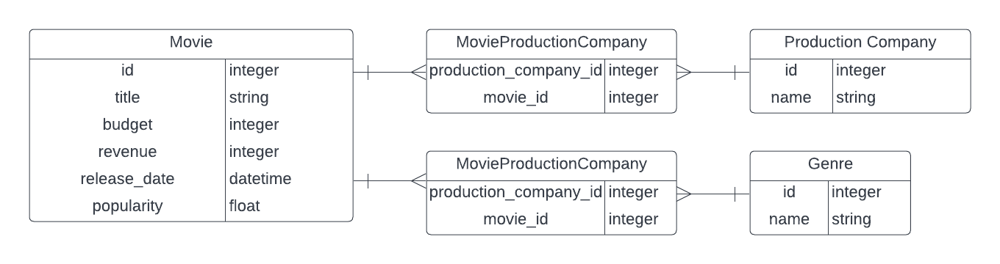

# Movies API

This API exposes endpoints that includes data about movies, their production companies, and genres. It is designed to address
the following at a minimum:

- Production Company Details - budget per year
- Production Company Details - revenue per year
- Movie Genre Details - most popular genre by year

## Get Started

This API is built with `Ruby v3.1.1` and `Rails v7.0.2`.
It uses `sqlite3` as the database for ActiveRecord.

### Install dependencies
  
Run `bundle install`

### Setup the database

Run `bundle exec rake db:setup` 

This will create your database and load the schema. Note that this command also runs `db:seed` to seed your database, but we'll be seeding it a bit differently.

There is a dataset of movies in a `csv` file located at `./the-movies-dataset/movies_metadata.csv`. 

Seed your database with ALL movies from the dataset (this should take 30-60 minutes:
`rake seed_db`

Or seed your database with a selected number of movies:
`rake seed_db[<number_of_movies>]`

### Running Specs

Specs are created with [rspec](https://relishapp.com/rspec/docs/gemversions) and can be run with the following command:

`bundle exec rspec`

## ERD

## Available Endpoints

| Action | Path | Optional Parameters | Description |
| --- | --- | --- | --- |
| GET | /movies | none | Lists all movies |
| GET | /production_companies | none | Lists all production companies |
| GET | /production_companies/:id | year | Shows production company by id including all time total budget, revenue, and movies produced. If `year` parameter is provided, total budget, revenue, and movies produced are limited to specified year. |
| GET | /genres/:year | none | Lists all genres of movies for specified year, including average popularity of each genre, in descending order |

## Sample Requests

## Future Work

- Pagination on `/movies` endpoint
- Additional POST `/movies` endpoint to upload a file or S3 url for additional datasets. This would utilize the `ParseMoviesMetadata` service
- Specs needed for `ParseMoviesMetadata` service
- More elaborate testing of controllers
- `ParseMoviesMetadata` performance optimization
- Request error handling 
- Class level documentation
- Method documentation (yard)
- Swagger/OpenAPI documentation for API endpoints